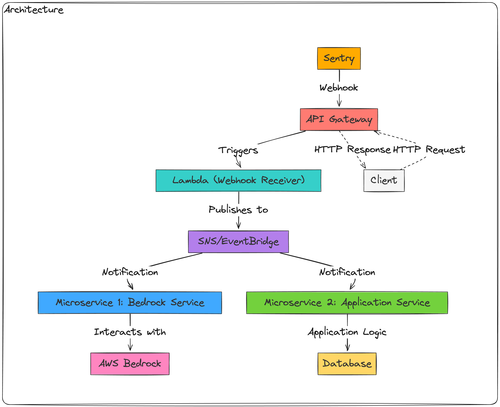

<br />
<div align="center">

  
</div>

## 📖 Table of Contents

- [🌟 Features](#-features)
- [🏗️ Monorepo Structure](#-monorepo-structure)
- [📋 Prerequisites](#-prerequisites)
- [🚀 Setup & Installation](#-setup--installation)
    - [🔗 Clone the Repository](#1--clone-the-repository)
    - [📦 Install Dependencies](#2--install-dependencies)
    - [🛠️ Environment Configuration](#3--environment-configuration)
- [🔧 Usage](#-usage)
  - [Building Services](#building-services)
  - [Linting Services](#linting-services)
  - [Running Tests](#running-tests)
- [🧪 Testing](#-testing)
- [📜 Authors](#-authors)

## 🌟 Features

- (tbd)

## 🏗️ Monorepo Structure
This project adopts a monorepo approach, meaning multiple related services are housed within a single repository. This setup allows for shared configurations, dependencies, and tooling across all microservices, providing a cohesive development experience.

A monorepo facilitates:

- Single-point dependency management using PNPM workspaces.
- Shared linting, building, and testing configurations for consistency.
- Streamlined CI/CD pipelines with service-specific and global configuration options.


## 📋 Prerequisites

- **Node.js (LTS version)**
    - Visit [Node.js](https://nodejs.org/en/) to install.
    - Confirm installation with `$ node -v`.
- **NVM (Node Version Manager) (optional)**
    - Visit [NVM](https://github.com/nvm-sh/nvm)
    - Confirm installation with `$ nvm -v`.
    - Use `nvm use` to switch to the project's Node.js version(`~/.nvrmrc`)
- **PNPM (Package Manager)**
    - Install PNPM globally with `$ npm install -g pnpm`.
    - Confirm installation with `$ pnpm -v`.
- **Serverless Framework (To be confirmed)**
  - Install Serverless Framework globally with `$ npm install -g serverless`.
  - Confirm installation with `$ serverless -v`.
- **TypeScript**
    - Install TypeScript globally with `$ npm install -g typescript`.
    - Verify installation with `$ tsc -v`.
- An IDE that supports TypeScript (e.g., Jetbrains Webstorm, Visual Studio Code).
- Access to AWS Bedrock and other AWS srevices

## 🚀 Setup & Installation

### 1. 🔗 **Clone the Repository:**

```bash
$ git clone https://github.com/colemvnio/genai-services.git
$ cd genai-services
```

### 2. 📦 **Install Dependencies:**

Navigate to the project directory and install the necessary packages:

```bash
$ pnpm install
```

### 3. 🛠️ **Environment Configuration:**

tbd

### 4. 🚀 **Launch the Project:**

tbd

## 🔧 Usage

This monorepo contains scripts configured for ease of use across all services:

> To filter by a service, use `pnpm --filter<service-name> <command>`.

### Building Services

To build all services, run:

```bash
$ pnpm run build
```

This command triggers the TypeScript compiler for each service and outputs the transpiled code to the respective `dist` directories.

### Linting Services

To lint all services, use:

```bash
$ pnpm run lint
```

For automated lint fixes:

```bash
$ pnpm run lint-fix
```

### Running Tests

To execute tests across all services, run:

```bash
$ pnpm run test
```

## 🧪 Testing

Each microservice includes its own tests. To run tests for a specific service, navigate to the service's directory and use the test script:

```bash
$ cd services/applicationService
$ pnpm run test
```

## 📁 Project Structure


```plaintext
/project-root
  /terraform                   # Terraform configurations for your infrastructure
    /modules                   # Reusable Terraform modules
    /environments              # Environment-specific configurations
      /prod                    # Production environment configurations
      /staging                 # Staging environment configurations
      /dev                     # Development environment configurations
  /api-gateway
    - serverless.yml          # Configures the AWS API Gateway, defining endpoints and integrating them with specific Lambda functions.
  /bedrockService             # A dedicated directory for the Bedrock service microservice.
    /src
      - handler.ts            # The main entry point for the Lambda function, handling incoming requests and invoking business logic.
      - logic.ts              # Contains the business logic specific to the Bedrock service, abstracted from the handler for better modularity.
      - circuitBreaker.ts     # Implements the Circuit Breaker pattern to manage calls to external services and dependencies.
    /tests
      - unit                  # Contains unit tests for testing individual components in isolation.
        - handler.spec.ts     # Tests for the Lambda handler, ensuring it processes requests correctly.
        - logic.spec.ts       # Tests for the business logic, ensuring each function behaves as expected under various conditions.
      - integration           # Contains integration tests for testing the integration points of the service, like external API calls.
        - integration.spec.ts # Tests the service as a whole, ensuring all components work together correctly.
      /helpers                # Service-specific test helpers for the Bedrock service.
        - bedrockHelpers.ts   # Utility functions and mocks tailored for testing the Bedrock service.
    - package.json            # Manages dependencies and scripts for the Bedrock service.
    - tsconfig.json           # TypeScript configuration for the Bedrock service, defining compiler options.
    - serverless.yml          # Deployment configuration for the Bedrock service, specifying AWS resources.
  /applicationService         # Similar structure to /bedrockService, tailored for another microservice.
  /common
    - utils.ts                # Shared utility functions that can be used across all services, like logging or error handling.
  /test-helpers               # Contains shared testing utilities and mocks for use across services.
    - mockAwsServices.ts      # Provides mocks for AWS services, useful for unit and integration testing without hitting real AWS endpoints.
    - testSetup.ts            # General setup and teardown functions for testing environments, applicable across services.
  /config
    - dev.json                # Configuration settings for the development environment, like database connections or external API keys.
    - prod.json               # Similar to dev.json, but for production settings.
  /scripts
    - deploy.sh                # Deployment scripts for CI/CD pipelines
    - test.sh                  # Scripts to run tests
  - README.md                  # Project documentation, explaining the architecture, setup, deployment, and contribution guidelines.
  - package.json               # Root-level package.json for managing scripts and dependencies that apply to the whole project.
  - pnpm-workspace.yaml        # Configuration for pnpm workspaces, enabling efficient dependency management across microservices.
  - tsconfig.json              # Root-level TypeScript configuration, often extending to individual services.

```
## 📜 Author

- [Patrick Coleman](https://www.linkedin.com/in/patrickc-developer/)
